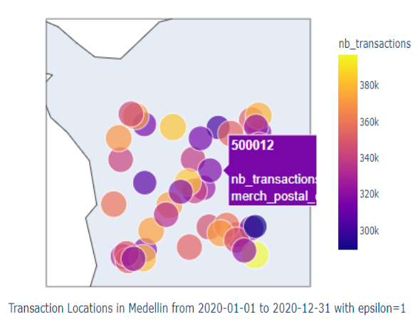
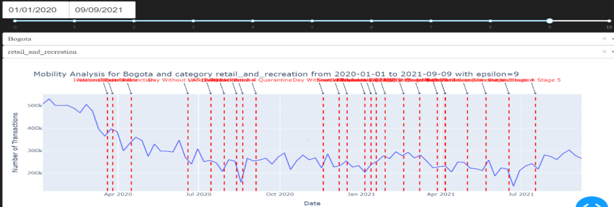
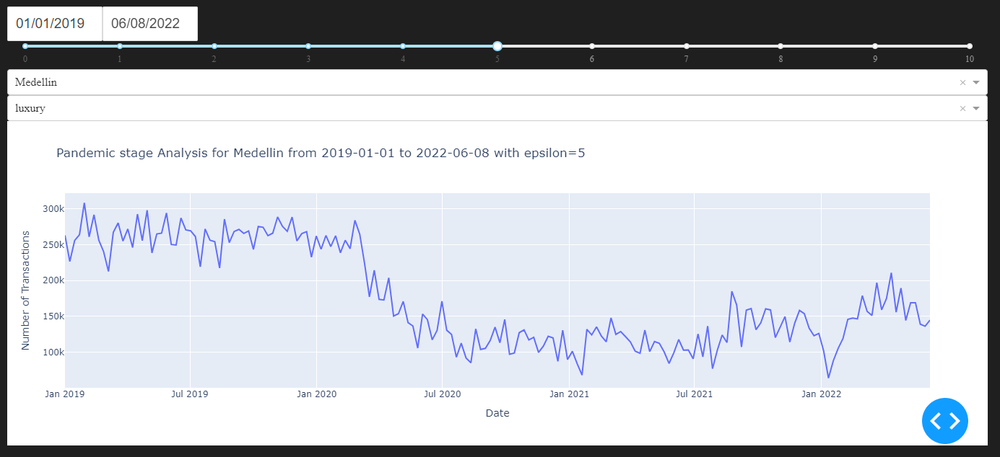
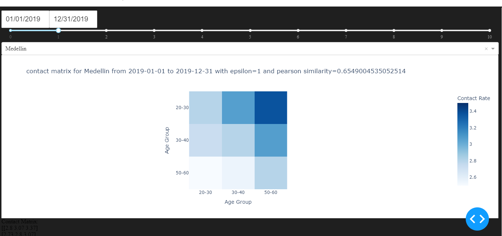

Usage
=====

.. _installation:

Installation
------------

To use DP_epidemiology, first install it using pip:

.. code-block:: console

   (.venv) $ pip install DP_epidemiology

.. _usage:

Tools
-----

To do hotspot detection,
you can use the ``hotspot_analyzer.hotspot_analyzer()`` function to generate differential private release of transactional data per zip code:

.. autofunction:: hotspot_analyzer.hotspot_analyzer

The ``df`` parameter take pandas dataframe as input with columns ``[ "ID", "date", "merch_category", "merch_postal_code", "transaction_type", "spendamt", "nb_transactions"]``.
The ``start_date`` and  ``end_date`` parameters take the start and end date of the time frame for which the analysis is to be done.
The ``city`` parameter takes the name of the city for which the analysis is to be done.
The ``epsilon`` parameter takes the value of epsilon for differential privacy.

For example:

>>> from DP_epidemiology import hotspot_analyzer
>>> from datetime import datetime
>>> df = pd.read_csv('data.csv')
>>> hotspot_analyzer.hotspot_analyzer(df,datetime(2020, 9, 1),datetime(2021, 3, 31),"Medellin",10)
	df_nb_transactions	postal_code
0	182274	500001
1	184207	500002
2	181038	500003
3	178536	500004
4	202206	500005
5	189752	500006

To visulize the hotspot,
you can use the ``viz.create_hotspot_dash_app()`` function:

.. autofunction:: viz.create_hotspot_dash_app

The ``df`` parameter take pandas dataframe as input with columns ``[ "ID", "date", "merch_category", "merch_postal_code", "transaction_type", "spendamt", "nb_transactions"]``.

For example:

>>> from DP_epidemiology import viz
>>> df = pd.read_csv('data.csv')
>>> app=viz.create_hotspot_dash_app(df)
>>> app.run_server(debug=True)

To do mobility inference,
you can use the ``mobility_analyzer.mobility_analyzer()`` function to generate differential private time series of trnsactional data in the "Airlines" category:

.. autofunction:: mobility_analyzer.mobility_analyzer

The ``df`` parameter take pandas dataframe as input with columns ``[ "ID", "date", "merch_category", "merch_postal_code", "transaction_type", "spendamt", "nb_transactions"]``.
The ``start_date`` and  ``end_date`` parameters take the start and end date of the time frame for which the analysis is to be done.
The ``city`` parameter takes the name of the city for which the analysis is to be done.
The ``epsilon`` parameter takes the value of epsilon for differential privacy.

For example:

>>> from DP_epidemiology import mobility_analyzer
>>> from datetime import datetime
>>> df = pd.read_csv('data.csv')
>>> mobility_analyzer.mobility_analyzer(df,datetime(2020, 9, 1),datetime(2021, 3, 31),"Medellin",10)
   nb_transactions       date
0              1258 2020-09-01
1              1328 2020-09-08
2              1281 2020-09-15
3              1162 2020-09-22
4              1182 2020-09-29
5              1264 2020-10-06

To visulize the mobility,
you can use the ``viz.create_mobility_dash_app()`` function:

.. autofunction:: viz.create_mobility_dash_app

The ``df`` parameter take pandas dataframe as input with columns ``[ "ID", "date", "merch_category", "merch_postal_code", "transaction_type", "spendamt", "nb_transactions"]``.

For example:

>>> from DP_epidemiology import viz
>>> df = pd.read_csv('data.csv')
>>> app=viz.create_mobility_dash_app(df)
>>> app.run_server(debug=True)

To do pandemic stage inference,
you can use the ``pandemic_adherence_analyzer.pandemic_stage_analyzer()`` function to generate differential private time series of trnsactional data for luxurious or essential goods:

.. autofunction:: pandemic_adherence_analyzer.pandemic_stage_analyzer

The ``df`` parameter take pandas dataframe as input with columns ``[ "ID", "date", "merch_category", "merch_postal_code", "transaction_type", "spendamt", "nb_transactions"]``.
The ``start_date`` and  ``end_date`` parameters take the start and end date of the time frame for which the analysis is to be done.
The ``city`` parameter takes the name of the city for which the analysis is to be done.
The``essential_or_luxury`` parameter takes the value of "essential" or "luxury" for which the analysis is to be done.
The ``epsilon`` parameter takes the value of epsilon for differential privacy.

For example:

>>> from DP_epidemiology import pandemic_adherence_analyzer
>>> from datetime import datetime
>>> df = pd.read_csv('data.csv')
>>> pandemic_adherence_analyzer.pandemic_adherence_analyzer(df,datetime(2020, 9, 1),datetime(2021, 3, 31),"Medellin",essential_or_luxury="luxury",epsilon=10)
   nb_transactions       date
0              1258 2020-09-01
1              1328 2020-09-08
2              1281 2020-09-15
3              1162 2020-09-22
4              1182 2020-09-29
5              1264 2020-10-06

To visulize the pandemic stages,
you can use the ``viz.create_pandemic_adherence_dash_app()`` function:

.. autofunction:: viz.create_pandemic_adherence_dash_app

The ``df`` parameter take pandas dataframe as input with columns ``[ "ID", "date", "merch_category", "merch_postal_code", "transaction_type", "spendamt", "nb_transactions"]``.

For example:

>>> from DP_epidemiology import viz
>>> df = pd.read_csv('data.csv')
>>> app=viz.create_pandemic_adherence_dash_app(df)
>>> app.run_server(debug=True)

To get the contact matrix,
you need to first get the age group count map using the ``contact_matrix.get_age_group_count_map()`` function:

.. autofunction:: contact_matrix.get_age_group_count_map

The ``df`` parameter take pandas dataframe as input with columns ``[ "ID", "date", "merch_category", "merch_postal_code", "transaction_type", "spendamt", "nb_transactions"]``.
The ``start_date`` and  ``end_date`` parameters take the start and end date of the time frame for which the analysis is to be done.
The ``pincode_prefix`` parameter indicating the starting digits that is common to all the pincodes of the country.
The ``epsilon`` parameter takes the value of epsilon for differential privacy.

For example:

>>> from DP_epidemiology import contact_matrix
>>> from datetime import datetime
>>> df = pd.read_csv('data.csv')
>>> contact_matrix.get_age_group_count_map(df,datetime(2020, 12, 12),datetime(2021, 1, 31),city="Bogota",epsilon=1.0)

Then you can use the ``contact_matrix.get_contact_matrix()`` function to generate differential private contact matrix:

.. autofunction:: contact_matrix.get_contact_matrix

The ``age_group_sample_size`` parameter takes the age group sample size distribution list. This will be generated by using the values from the map returned by the ``get_age_group_count_map()`` function.
The ``age_group_population_distribution`` parameter takes the age group population distribution list for the country.

For example:

>>> from DP_epidemiology import contact_matrix
>>> from datetime import datetime
>>> df = pd.read_csv('data.csv')
>>>age_group_population_distribution =  [8231200, 7334319, 6100177]
>>> age_group_count_map = contact_matrix.get_age_group_count_map(df,datetime(2020, 12, 12),datetime(2021, 1, 31),city="Bogota",epsilon=1.0)
>>> contact_matrix.get_contact_matrix(list(age_group_count_map.values()),age_group_population_distribution)

.. code-block:: console
   
   [[2.8        3.11030655 3.46168911]
   [2.77140397 2.8        3.0734998 ]
   [2.56547238 2.5563236  2.8       ]]

To visulize the contact matrix,
you can use the ``viz.create_contact_matrix_dash_app()`` function:

.. autofunction:: viz.create_contact_matrix_dash_app

The ``df`` parameter take pandas dataframe as input with columns ``[ "ID", "date", "merch_category", "merch_postal_code", "transaction_type", "spendamt", "nb_transactions"]``.

For example:

>>> from DP_epidemiology import viz
>>> df = pd.read_csv('data.csv')
>>> app=viz.create_contact_matrix_dash_app(df)
>>> app.run_server(debug=True)

