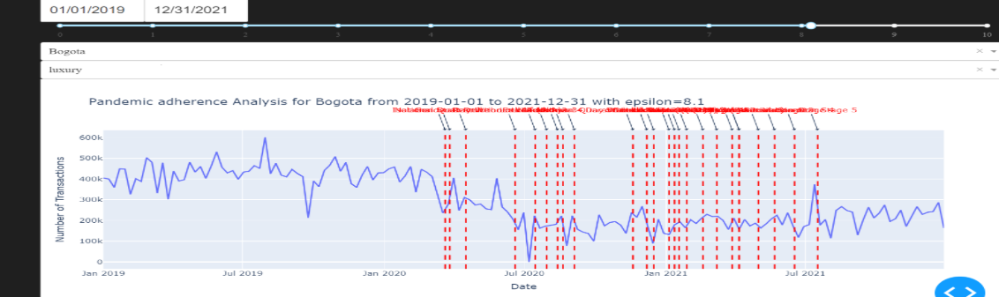
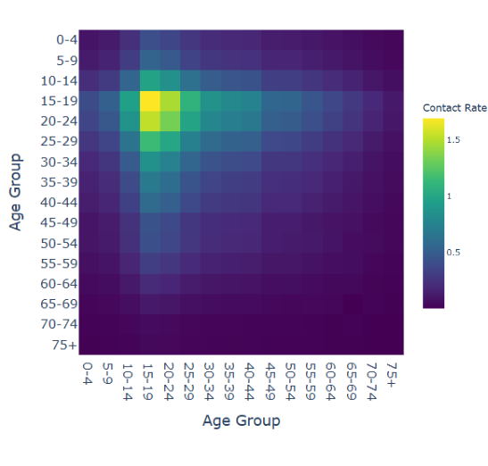

Usage
=====

.. _installation:

Installation
------------

To use DP_epidemiology, first install it using pip:

.. code-block:: console

   (.venv) $ pip install DP_epidemiology

.. _usage:

Tools
-----

To do hotspot detection,
you can use the ``hotspot_analyzer.hotspot_analyzer()`` function to generate differential private release of transactional data per zip code:

.. autofunction:: hotspot_analyzer.hotspot_analyzer

The ``df`` parameter takes a pandas DataFrame as input with columns ``[ "ID", "date", "merch_category", "merch_postal_code", "transaction_type", "spendamt", "nb_transactions"]``.
The ``city_zipcode_map`` parameter takes a pandas DataFrame mapping cities to zip codes.
The ``start_date`` and ``end_date`` parameters take the start and end date of the time frame for which the analysis is to be done.
The ``city`` parameter takes the name of the city for which the analysis is to be done.
The ``default_city`` parameter specifies the fallback city for unmapped zip codes.
The ``epsilon`` parameter takes the value of epsilon for differential privacy.

For example:

>>> from DP_epidemiology import hotspot_analyzer
>>> from datetime import datetime
>>> import pandas as pd
>>> df = pd.read_csv('data.csv')
>>> city_zipcode_map = pd.read_csv('city_zipcode_map.csv')
>>> hotspot_analyzer.hotspot_analyzer(df, city_zipcode_map, datetime(2020, 9, 1), datetime(2021, 3, 31), "Medellin", "Bogota", 10)
   nb_transactions  merch_postal_code
0           182274            500001
1           184207            500002
2           181038            500003
3           178536            500004
4           202206            500005
5           189752            500006

To visualize the hotspot,
you can use the ``viz.create_hotspot_dash_app()`` function:

.. autofunction:: viz.create_hotspot_dash_app

The ``df`` parameter takes a pandas DataFrame as input with columns ``[ "ID", "date", "merch_category", "merch_postal_code", "transaction_type", "spendamt", "nb_transactions"]``.
The ``city_zipcode_map`` parameter takes a pandas DataFrame mapping cities to zip codes.
The ``default_city`` parameter specifies the fallback city for unmapped zip codes.

For example:

>>> from DP_epidemiology import viz
>>> import pandas as pd
>>> df = pd.read_csv('data.csv')
>>> city_zipcode_map = pd.read_csv('city_zipcode_map.csv')
>>> app = viz.create_hotspot_dash_app(df, city_zipcode_map, "Bogota")
>>> app.run_server(debug=True)

.. image:: images/hotspot.png
   :alt: hotspot

To do mobility inference,
you can use the ``mobility_analyzer.mobility_analyzer()`` function to generate differentially private time series of transactional data in various merchant supercategories:

.. autofunction:: mobility_analyzer.mobility_analyzer

The ``df`` parameter takes a pandas DataFrame as input with columns ``[ "ID", "date", "merch_category", "merch_postal_code", "transaction_type", "spendamt", "nb_transactions"]``.
The ``city_zipcode_map`` parameter takes a pandas DataFrame mapping cities to zip codes.
The ``start_date`` and ``end_date`` parameters take the start and end date of the time frame for which the analysis is to be done.
The ``city`` parameter takes the name of the city for which the analysis is to be done.
The ``default_city`` parameter specifies the fallback city for unmapped zip codes.
The ``category`` parameter takes the value of a merchant supercategory (e.g., ``retail_and_recreation``, ``grocery_and_pharmacy``, or ``transit_stations``) for which the analysis is to be done.
The ``epsilon`` parameter takes the value of epsilon for differential privacy.

For example:

>>> from DP_epidemiology import mobility_analyzer
>>> from datetime import datetime
>>> import pandas as pd
>>> df = pd.read_csv('data.csv')
>>> city_zipcode_map = pd.read_csv('city_zipcode_map.csv')
>>> mobility_analyzer.mobility_analyzer(df, city_zipcode_map, datetime(2020, 9, 1), datetime(2021, 3, 31), "Medellin", "Bogota", "retail_and_recreation", 10)
   nb_transactions       date
0              1258 2020-09-01
1              1328 2020-09-08
2              1281 2020-09-15
3              1162 2020-09-22
4              1182 2020-09-29
5              1264 2020-10-06

To visualize mobility,
you can use the ``viz.create_mobility_dash_app()`` function:

.. autofunction:: viz.create_mobility_dash_app

The ``df`` parameter takes a pandas DataFrame as input with columns ``[ "ID", "date", "merch_category", "merch_postal_code", "transaction_type", "spendamt", "nb_transactions"]``.
The ``city_zipcode_map`` parameter takes a pandas DataFrame mapping cities to zip codes.
The ``default_city`` parameter specifies the fallback city for unmapped zip codes.

For example:

>>> from DP_epidemiology import viz
>>> import pandas as pd
>>> df = pd.read_csv('data.csv')
>>> city_zipcode_map = pd.read_csv('city_zipcode_map.csv')
>>> app = viz.create_mobility_dash_app(df, city_zipcode_map, "Bogota")
>>> app.run_server(debug=True)

To do pandemic adherence inference,
you can use the ``pandemic_adherence_analyzer.pandemic_adherence_analyzer()`` function to generate differential private time series of transactional data for luxury or essential goods:

.. autofunction:: pandemic_adherence_analyzer.pandemic_adherence_analyzer

The ``df`` parameter takes a pandas DataFrame as input with columns ``["ID", "date", "merch_category", "merch_postal_code", "transaction_type", "spendamt", "nb_transactions"]``.
The ``start_date`` and ``end_date`` parameters specify the time frame for which the analysis is to be conducted.
The ``city`` parameter specifies the city for which the analysis is to be conducted.
The ``essential_or_luxury`` parameter takes the value "essential", "luxury", or "other" depending on the goods to be analyzed.
The ``epsilon`` parameter sets the epsilon value for differential privacy.

For example:

>>> from DP_epidemiology import pandemic_adherence_analyzer
>>> from datetime import datetime
>>> df = pd.read_csv('data.csv')
>>> pandemic_adherence_analyzer.pandemic_adherence_analyzer(df, city_zipcode_map, datetime(2020, 9, 1), datetime(2021, 3, 31), "Medellin", default_city="DefaultCity", essential_or_luxury="luxury", epsilon=10)
   nb_transactions       date
0              1258 2020-09-01
1              1328 2020-09-08
2              1281 2020-09-15
3              1162 2020-09-22
4              1182 2020-09-29
5              1264 2020-10-06

To visualize the pandemic adherence,
you can use the ``viz.create_pandemic_adherence_dash_app()`` function:

.. autofunction:: viz.create_pandemic_adherence_dash_app

The ``df`` parameter takes a pandas DataFrame as input with columns ``["ID", "date", "merch_category", "merch_postal_code", "transaction_type", "spendamt", "nb_transactions"]``.
The ``city_zipcode_map`` parameter specifies the city-zipcode mapping DataFrame.
The ``default_city`` parameter sets the default city for mapping purposes.

For example:

>>> from DP_epidemiology import viz
>>> df = pd.read_csv('data.csv')
>>> city_zipcode_map = pd.read_csv('city_zipcode_map.csv')
>>> app = viz.create_pandemic_adherence_dash_app(df, city_zipcode_map, default_city="DefaultCity")
>>> app.run_server(debug=True)

# To get the contact matrix
#
# You need to first get the age group count map using the `contact_matrix.get_age_group_count_map()` function:

.. autofunction:: contact_matrix.get_age_group_count_map

The `df` parameter takes a pandas dataframe as input with columns `[ "ID", "date", "merch_category", "merch_postal_code", "transaction_type", "spendamt", "nb_transactions"]`.
The `start_date` and `end_date` parameters take the start and end dates of the time frame for which the analysis is to be performed.
The `city` parameter specifies the city for which the analysis is conducted.
The `epsilon` parameter takes the value of epsilon for differential privacy.

For example:

>>> from DP_epidemiology import contact_matrix
>>> from datetime import datetime
>>> df = pd.read_csv('data.csv')
>>> contact_matrix.get_age_group_count_map(df, datetime(2020, 12, 12), datetime(2021, 1, 31), city="Bogota", epsilon=1.0)

Then you can use the `contact_matrix.get_contact_matrix()` function to generate a differential private contact matrix:

.. autofunction:: contact_matrix.get_contact_matrix

The `sample_distribution` parameter takes the age group sample size distribution list. This will be generated using the values from the map returned by the `get_age_group_count_map()` function.
The `population_distribution` parameter takes the age group population distribution list for the country.

For example:

>>> from DP_epidemiology import contact_matrix
>>> from datetime import datetime
>>> df = pd.read_csv('data.csv')
>>> age_group_population_distribution = [8231200, 7334319, 6100177]
>>> age_group_count_map = contact_matrix.get_age_group_count_map(df, datetime(2020, 12, 12), datetime(2021, 1, 31), city="Bogota", epsilon=1.0)
>>> contact_matrix.get_contact_matrix(list(age_group_count_map.values()), age_group_population_distribution)

.. code-block:: console

   [[2.8        3.11030655 3.46168911]
    [2.77140397 2.8        3.0734998 ]
    [2.56547238 2.5563236  2.8       ]]

To calculate the country-wide contact matrix, you can use the `contact_matrix.get_contact_matrix_country()` function to generate a differential private contact matrix:

.. autofunction:: contact_matrix.get_contact_matrix_country

The `counts_per_city` parameter takes the age group count map for each city in the country.
The `population_distribution` parameter takes the age group population distribution list for the country.
The `scaling_factor` parameter scales the population distribution while estimating the total number of contacts across age groups.

For example:

>>> from DP_epidemiology import contact_matrix
>>> from datetime import datetime
>>> age_groups = ['0-4', '5-9', '10-14', '15-19', '20-24', '25-29', '30-34', '35-39', '40-44', '45-49', '50-54', '55-59', '60-64', '65-69', '70-74', '75+']
>>> week = "2021-01-05"
>>> start_date = datetime.strptime(week, '%Y-%m-%d')
>>> end_date = datetime.strptime(week, '%Y-%m-%d')
>>> from DP_epidemiology.utilities import make_preprocess_location
>>> df = make_preprocess_location()(df)
>>> cities = df['city'].unique()
>>> age_group_count_map_per_city = []
>>> for city in cities:
...     age_group_count_map = contact_matrix.get_age_group_count_map(df, city_zipcode_map, age_groups, consumption_distribution, start_date, end_date, city, default_city)
...     age_group_count_map_per_city.append(list(age_group_count_map.values()))
>>> population_distribution = [4136344, 4100716, 3991988, 3934088, 4090149, 4141051, 3895117, 3439202, 3075077, 3025100, 3031855, 2683253, 2187561, 1612948, 1088448, 1394217]
>>> from DP_epidemiology.contact_matrix import get_contact_matrix_country
>>> estimated_contact_matrix = get_contact_matrix_country(age_group_count_map_per_city, population_distribution, scaling_factor)

To visualize the contact matrix, you can use the `viz.create_contact_matrix_dash_app()` function:

.. autofunction:: viz.create_contact_matrix_dash_app

The `df` parameter takes a pandas dataframe as input with columns `[ "ID", "date", "merch_category", "merch_postal_code", "transaction_type", "spendamt", "nb_transactions"]`.

For example:

>>> from DP_epidemiology import viz
>>> df = pd.read_csv('data.csv')
>>> app = viz.create_contact_matrix_dash_app(df)
>>> app.run_server(debug=True)

Dash Application for Mobility and Pandemic Analysis
===================================================

This module creates a Dash web application for analyzing mobility and pandemic adherence using transactional and Google mobility data. The application provides multiple tabs for different types of analysis, including hotspot analysis, mobility analysis, pandemic adherence analysis, contact matrix analysis, and mobility validation.

Functions
---------

create_dash_app(df: pd.DataFrame, df_google_mobility_data: pd.DataFrame = None)
    Creates and returns a Dash application.

    Parameters:
        df (pd.DataFrame): DataFrame containing transactional data.
        df_google_mobility_data (pd.DataFrame, optional): DataFrame containing Google mobility data.

    Returns:
        app (dash.Dash): Dash application instance.

Example Usage
-------------

.. code-block:: python

    import pandas as pd
    from dash_app import create_dash_app

    # Load data
    df = pd.read_csv(r'D:\workspace\pet_local\technical_phase_data.csv')
    df_google_mobility_data = pd.read_csv('D:\workspace\PETs_challenge_data.csv')

    # Create and run the Dash app
    app = create_dash_app(df, df_google_mobility_data)
    app.run_server(debug=True)

Application Layout
------------------

The application consists of the following tabs:

1. **Hotspot Analysis**:
    - Date pickers for selecting start and end dates.
    - Slider for selecting epsilon value.
    - Dropdown for selecting city.
    - Geo plot displaying transaction locations.

2. **Mobility Analysis**:
    - Date pickers for selecting start and end dates.
    - Slider for selecting epsilon value.
    - Dropdown for selecting city.
    - Dropdown for selecting category.
    - Line graph displaying mobility analysis.

3. **Pandemic Adherence Analysis**:
    - Date pickers for selecting start and end dates.
    - Slider for selecting epsilon value.
    - Dropdown for selecting city.
    - Dropdown for selecting entry type (luxury, essential, other).
    - Line graph displaying pandemic adherence analysis.

4. **Contact Matrix Analysis**:
    - Date pickers for selecting start and end dates.
    - Slider for selecting epsilon value.
    - Dropdown for selecting city.
    - Heatmap displaying contact matrix.
    - Text output displaying contact matrix values.

5. **Mobility Validation**:
    - Date pickers for selecting start and end dates.
    - Slider for selecting epsilon value.
    - Dropdown for selecting city.
    - Dropdown for selecting category.
    - Line graph displaying mobility validation analysis.

Callbacks
---------

The application uses several callbacks to update the graphs based on user inputs. Each tab has its own callback function to handle the updates.

- `update_hotspot_graph`: Updates the hotspot geo plot.
- `update_mobility_graph`: Updates the mobility analysis graph.
- `update_adherence_graph`: Updates the pandemic adherence analysis graph.
- `update_contact_matrix`: Updates the contact matrix heatmap and text output.
- `update_validation_graph`: Updates the mobility validation graph.